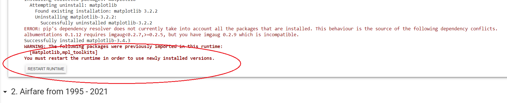
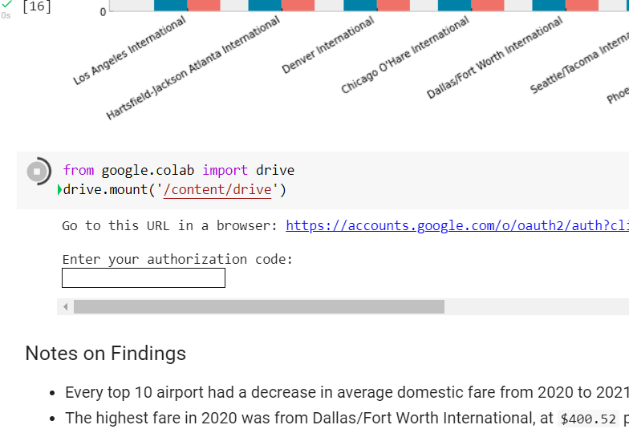

# Airfare Rates in the US


## About

This project is to compare airfare prices overall trends from 1995 to 2021, then focus on the differences between Q1 of 2020 and 2021. 

The COVID-19 pandemic had a profound effect on domestic travel in the U.S. The restrictions on travel guidelines and procedures left many airplanes flying empty of passengers.[^1] Consumers could plainly see that the price of airfare was falling.

The Bureau of Transportation Statistics refers to the months of January 1 - March 31 as Q1. 

- The first U.S. citizen to test positive for COVID-19 occurred on January 21, 2020.[^2]
- On March 11, 2020, the World Health Organization officially "declared COVID-19 a global pandemic."[^3] 
- California became the first state to issue a "Shelter at Home" order on March 19, 2020.[^4] 
- The first quarter of 2020, while not uneffected by the pandemic, was less effected than the remainder of the year.[^5]
- Q1 of 2021 had record-high new cases in January, and while declining by March 31, the new cases never fell to the highest recorded new cases in Q1 of 2020.[^6]

I would like to explore how Q1 of 2020, with few cases and restrictions for most of the quarter, compares to Q1 of 2021, with several new cases and restrictions for the duration of the quarter. 

**Questions:**

* Did the rates in 2021 deviate from overall trends of the previous 25 years?
* How do 2020 and 2021 differ?
* Do we see a difference in prices from all airports?

## METHODOLOGY

Data was retrieved and analyzed from the Bureau of Transportation Statistics. 
1. Prices adjusted for inflation, 1995 - 2021[^7]
2. All US Airports, from Q1 (January - March) reports, 2020 and 2021[^8]

## TO USE THIS REPO

### OPTION 1: Easy Method, Google Colab

If you have a Google account, you can run this repo without downloading any languages, libraries or tools.

1. [Click here to gain viewer access to the Colab Notebook.](https://colab.research.google.com/drive/1JPENFr6RbdmWxLNaZtIp0CFmXIX91hW8?usp=sharing)
2. Make a copy or download the notebook.
3. In your copy or download, open the `airfare-data.ipynb` file:
   * Click `Runtime` tab.
   * Click `Run All`.

**Common Errors with Colab**

1. Runtime
   
Under `RESULTS` > `1. Import Libraries`, you may get this runtime error:



To correct, on the toolbar menu, click `Runtime`, then scroll to `Restart runtime`. Once that has completed, click once more on the `Runtime` menu and scroll to `Run all`. 

2. Authorization Code

Under the bar graph for the Top 10 Airports 2020 and 2021 comparison, you may see this attempt from Google to import Google Drive. 



Follow the instructions prompted. Click the link it provides, copy the authorization code and enter it into the field on the Colab file. 


You may be asked to sign into your Google account again during this step. 

Once you paste your authorization code, tap the `Enter` key to continue. 

### OPTION 2: Cloning the repo

#### Tools and Libraries

This repo utilizes a number of tools and libraries that are all included with Anaconda. 
[Anaconda documentation and install](https://docs.anaconda.com)
Anaconda released an update on [September 24, 2020](https://docs.anaconda.com/anaconda/navigator/release-notes/). This repo runs on that latest release. 

You can update by opening your terminal and enter:
```
conda update conda
conda install anaconda=VersionNumber
```
[Click here](https://docs.anaconda.com/anaconda/install/update-version/) for notes on updating. 

If you do not wish to install Anaconda, be sure your machine has the following:
* [Python 3.0 or higher](https://www.python.org)
* [Jupyter Notebook](https://jupyter.org)
* [pandas](https://pandas.pydata.org/pandas-docs/stable/index.html)
* [NumPy](https://numpy.org/doc/)
* [Matplotlib](https://matplotlib.org): Must be version 3.4 

#### Running the Program in Jupyter Notebook
1. Clone the repository.
2. Save the folder.
3. Open `jupyter notebook` from command line or start menu.
4. Navigate to the saved location of the repo.
5. Open `airfare-data.ipynb`.
6. Click `Cell` tab and then `Run All`.

#### Running the Program in Python
1. Clone the repository
2. Save the folder.
3. Open the saved repository in your IDE or terminal.
4. Run the `airfare-data.py` file. 
   
Citations:
[^1]: [Why Empty Planes Keep Flying Through the Pandemic, Wall Street Journal](https://www.wsj.com/articles/why-empty-planes-keep-flying-through-the-pandemic-11588771233).
[^2]: [First Travel-related Case of 2019 Novel Coronavirus Detected in United States, CDC](https://www.cdc.gov/media/releases/2020/p0121-novel-coronavirus-travel-case.html)
[^3]: [WHO Director-General's opening remarks at the media briefing on COVID-19 - 11 March 2020](https://www.who.int/director-general/speeches/detail/who-director-general-s-opening-remarks-at-the-media-briefing-on-covid-19---11-march-2020)
[^4]: [Executive Order N-33-20, CA.Gov](https://www.gov.ca.gov/wp-content/uploads/2020/03/3.19.20-attested-EO-N-33-20-COVID-19-HEALTH-ORDER.pdf)
[^5]: [United States: How many tests are performed each day?, Our World in Data](https://ourworldindata.org/coronavirus/country/united-states#how-many-tests-are-performed-each-day)
[^6]: [Trends in Number of COVID-19 Cases and Deaths in the US Reported to CDC, by State/Territory, CDC](https://covid.cdc.gov/covid-data-tracker/#trends_dailycases%7CNew_case%7Cselect)
[^7]: [Annual U.S. Domestic Average Itinerary Fare in Current and Constant Dollars](https://www.bts.gov/content/annual-us-domestic-average-itinerary-fare-current-and-constant-dollars)
[^8]: [Average Domestic Airline Itinerary Fares](https://www.transtats.bts.gov/AverageFare/)